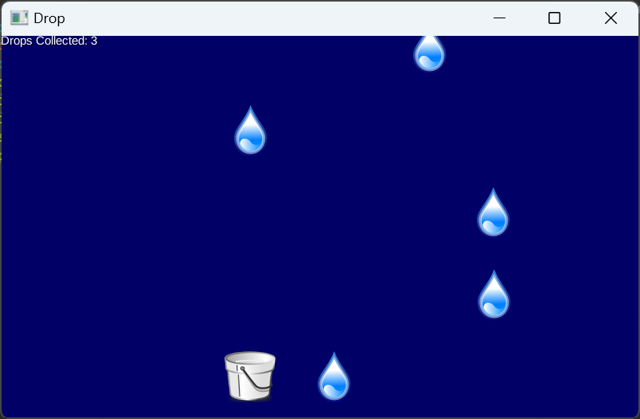

# libgdx-demo-drop
Simple raindrop catching Java game built with LibGDX library.
**This project is archived and serves as a showcase. I am no longer maintaining this project.**

## Info
Game logic/code can be found at https://github.com/alarconm96/libgdx-demo-drop/blob/main/core/src/com/badlogic/drop/GameScreen.java

## Project Goals/Reflection
* Practice using Java in Eclipse
* Integrating LibGDX libraries into project
* Practice using Git version control principles
